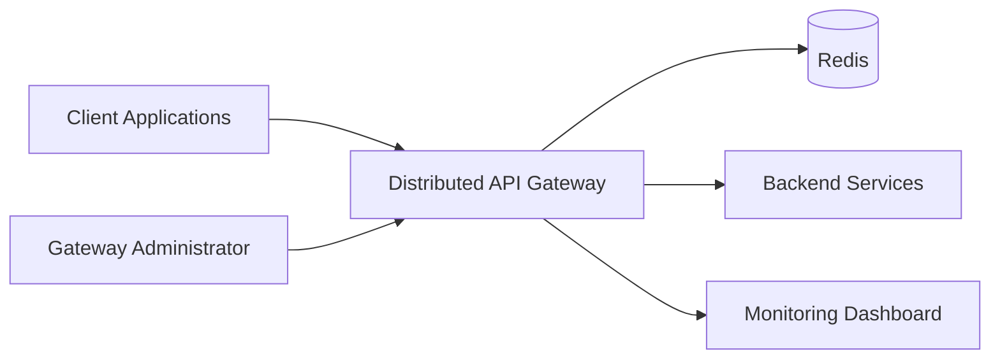
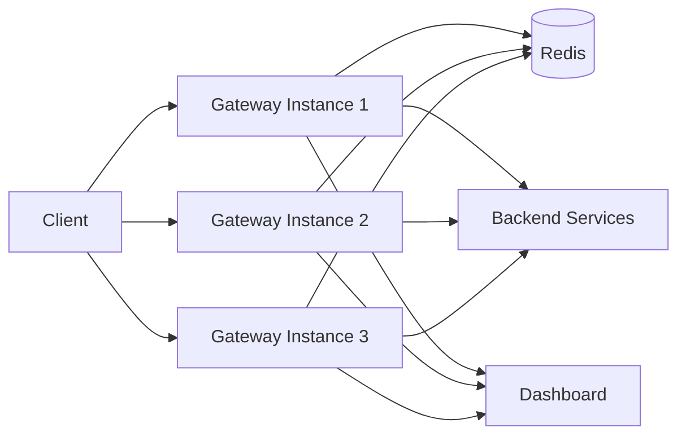
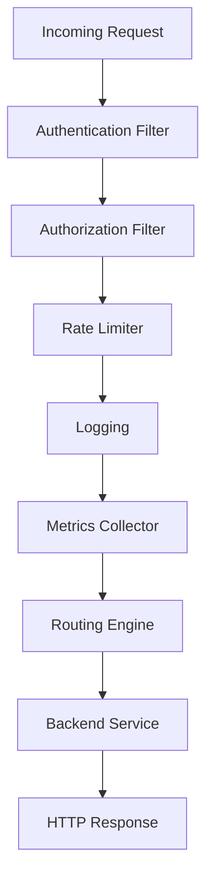
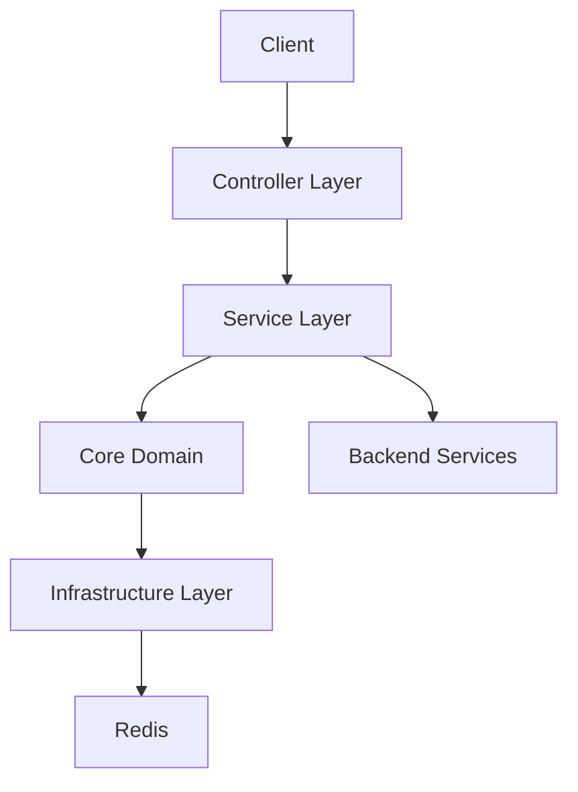
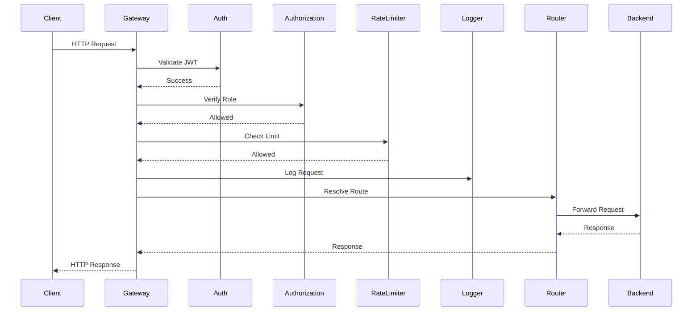
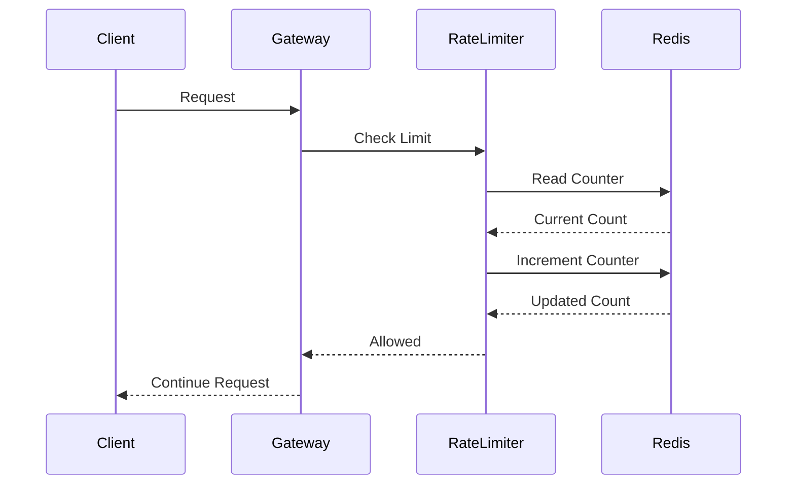
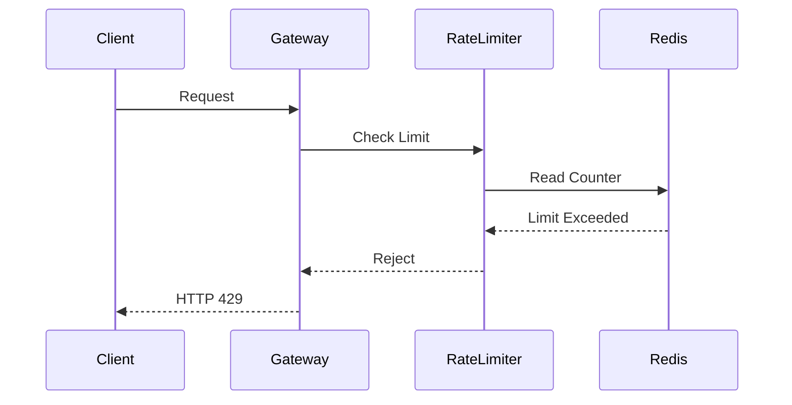
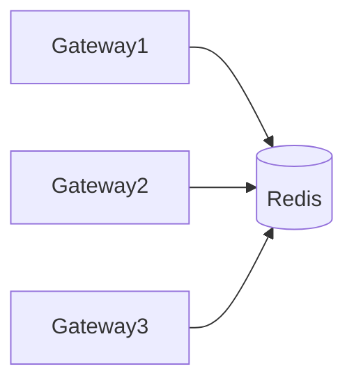
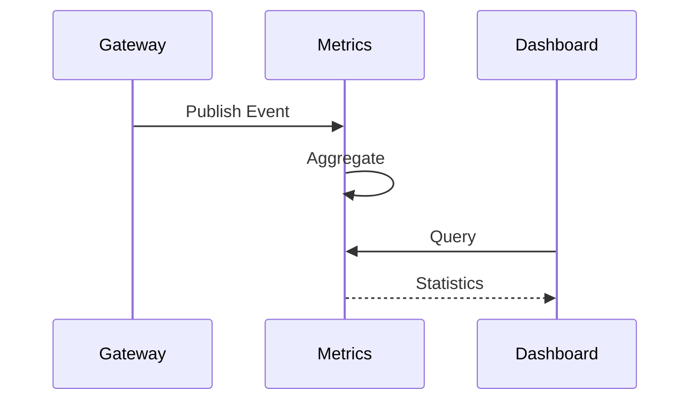

# Distributed API Gateway + Rate Limiter

# Architecture Document

Version: 1.0

Status: Draft

---

# 1. Purpose

This document defines the complete architecture of the Distributed API Gateway project.

Unlike the Product Requirements Document, which specifies **what** the system should achieve, this document specifies **how** the system is structured, how components interact, how requests flow through the system, and how the architecture evolves throughout development.

This document acts as the single source of truth for:

- System Architecture
- Component Relationships
- Request Lifecycle
- Deployment Architecture
- Runtime Behaviour
- Package Design
- Engineering Decisions

---

# 2. Architecture Goals

The architecture is designed to satisfy the following objectives:

- Separation of Concerns
- Scalability
- Maintainability
- Testability
- Extensibility
- Security
- Observability
- Production Readiness

Every architectural decision should improve one or more of these goals.

---

# 3. Architectural Principles

## AP-001

Single Responsibility

Every component must own exactly one primary responsibility.

---

## AP-002

Explicit Dependencies

Component relationships must always be visible.

No hidden dependencies.

---

## AP-003

Dependency Direction

Dependencies always point inward.

Outer layers depend on inner layers.

Inner layers never depend on outer layers.

---

## AP-004

Stateless Gateway

Gateway instances should remain stateless whenever possible.

Shared state belongs inside Redis.

---

## AP-005

Replaceability

Every major subsystem should be replaceable.

Examples

Authentication Provider

Rate Limiting Algorithm

Redis Client

Logging Provider

Metrics Provider

---

## AP-006

Configuration over Code

Behaviour should be controlled through configuration rather than source code modifications.

---

## AP-007

Observability First

Every request should be observable.

Every failure should be diagnosable.

---

# 4. High-Level System Context

The API Gateway sits between external clients and backend services.

Its responsibility is to validate, protect, monitor, and route incoming requests.

```text
                     Internet
                         │
                         ▼
                  Client Applications
                         │
                         ▼
                Distributed API Gateway
                         │
        ┌────────────────┼────────────────┐
        │                │                │
        ▼                ▼                ▼
 Authentication     Rate Limiter      Analytics
        │                │                │
        └────────────────┼────────────────┘
                         │
                         ▼
                  Routing Engine
                         │
                         ▼
                 Backend Services
```

---

# Why This Architecture?

Without a gateway:

- Authentication logic is duplicated.
- Rate limiting becomes inconsistent.
- Logging is fragmented.
- Monitoring becomes difficult.
- Security policies diverge.
- Backend services become tightly coupled to clients.

The gateway centralizes these cross-cutting concerns.

---

# Responsibilities of the Gateway

The gateway is responsible for:

- Authenticating requests
- Authorizing access
- Enforcing rate limits
- Logging requests
- Collecting metrics
- Routing traffic
- Protecting backend services
- Returning standardized error responses

The gateway is **not** responsible for business logic.

---

# 5. External Actors

## Client

Responsibilities

- Sends HTTP requests
- Includes JWT when required
- Receives responses

Examples

- Mobile App
- Web Application
- Internal Service
- Third-party Client

---

## Gateway Administrator

Responsibilities

- Configure routes
- Configure rate limits
- Monitor traffic
- View analytics
- Maintain gateway configuration

---

## Backend Services

Responsibilities

- Execute business logic
- Return application responses

Backend services trust the gateway.

---

## Redis

Responsibilities

- Shared distributed state
- Rate limit counters
- Temporary metadata

Redis does not contain business data.

---

# 6. Architectural Boundaries

The architecture is divided into distinct responsibility boundaries.

```text
+------------------------------------------------------+
|                  Client Boundary                      |
+------------------------------------------------------+

                HTTP / HTTPS

+------------------------------------------------------+
|                Gateway Boundary                       |
|                                                      |
| Authentication                                       |
| Authorization                                        |
| Rate Limiting                                        |
| Routing                                              |
| Logging                                               |
| Metrics                                               |
+------------------------------------------------------+

          Internal Network Communication

+------------------------------------------------------+
|              Backend Boundary                         |
|                                                      |
| Business Logic                                       |
| Databases                                            |
| External APIs                                        |
+------------------------------------------------------+

           Distributed State Boundary

+------------------------------------------------------+
|                     Redis                             |
+------------------------------------------------------+
```

---

# 7. Architectural Characteristics

| Characteristic | Goal |
|---------------|------|
| Scalability | Horizontal Scaling |
| Availability | High |
| Performance | Low Latency |
| Security | Centralized |
| Reliability | High |
| Maintainability | High |
| Testability | High |
| Observability | High |

---

# 8. Core Components

The system consists of the following high-level components.

| Component | Responsibility |
|------------|---------------|
| Gateway | Entry point |
| Authentication | Identity verification |
| Authorization | Access control |
| Routing Engine | Forward requests |
| Rate Limiter | Abuse prevention |
| Redis | Shared counters |
| Logging | Request tracing |
| Metrics | Analytics |
| Dashboard | Visualization |

Each component owns a single responsibility.

No component should perform another component's work.

---

# 9. Component Relationships

```text
                Client
                   │
                   ▼
              API Gateway
                   │
 ┌─────────────────┼─────────────────┐
 ▼                 ▼                 ▼
Authentication Authorization Rate Limiter
        │              │              │
        └──────────────┼──────────────┘
                       ▼
                Routing Engine
                       │
                       ▼
               Backend Services
                       │
                       ▼
                  HTTP Response
```

---

# 10. Architectural Evolution

The architecture intentionally evolves during development.

The final architecture is **not** built immediately.

Each phase introduces one new subsystem while preserving existing behaviour.

This allows:

- Easier debugging
- Incremental learning
- Stable milestones
- Production-like evolution

Subsequent sections of this document describe the architectural evolution phase by phase.

---

# 11. C4 Architecture Model

The project architecture is documented using the **C4 Model**, a hierarchical approach to visualizing software systems.

The C4 Model progressively zooms into the system through four abstraction levels.

| Level | Focus |
|--------|-------|
| Level 1 | System Context |
| Level 2 | Container Diagram |
| Level 3 | Component Diagram |
| Level 4 | Code / Package Diagram |

This approach keeps the architecture understandable without overwhelming readers.

---

# Level 1 — System Context Diagram

## Purpose

Describe how the API Gateway interacts with external actors.

### External Actors

- API Clients
- Gateway Administrator
- Backend Services
- Redis
- Monitoring Dashboard

---

## System Context



---

## Explanation

### Client Applications

Generate HTTP requests.

Examples

- Mobile Applications
- Web Applications
- Third-party Integrations
- Internal Services

---

### Gateway Administrator

Responsible for

- Route configuration
- Monitoring
- Rate limit configuration
- Analytics

---

### Distributed API Gateway

Central entry point.

Owns

- Authentication
- Authorization
- Routing
- Rate Limiting
- Logging
- Metrics

---

### Redis

Provides

- Shared Counters
- Distributed State
- TTL Support
- Atomic Operations

---

### Backend Services

Own business logic.

Remain unaware of

- Authentication
- Rate Limiting
- Logging

---

### Monitoring Dashboard

Displays

- Live Requests

- Blocked Requests

- Allowed Requests

- Redis Status

- Gateway Health

---

# Why C4 Level 1?

This diagram intentionally hides implementation details.

It answers

"What systems interact with our Gateway?"

---

# Level 2 — Container Diagram

## Purpose

Describe deployable applications.

Containers represent independently deployable units.

---



---

# Container Responsibilities

## Gateway Instances

Technology

Spring Boot

Responsibilities

- Authentication

- Authorization

- Rate Limiting

- Routing

- Logging

- Metrics

Characteristics

Stateless

Horizontally scalable

---

## Redis

Technology

Redis

Responsibilities

- Shared Counters

- Atomic Operations

- TTL

- Distributed State

---

## Backend Services

Technology

Independent

Responsibilities

Business Logic

Database Access

External APIs

---

## Dashboard

Technology

React (Planned)

Responsibilities

Visualize

- Metrics

- Analytics

- Gateway Status

---

# Why Multiple Gateway Instances?

Advantages

- High Availability

- Horizontal Scaling

- Fault Tolerance

- Increased Throughput

---

# Level 3 — Component Diagram

## Purpose

Describe the internal architecture of a single Gateway instance.

---



---

# Component Responsibilities

## Authentication Filter

Responsibilities

- Read JWT

- Validate JWT

- Build Security Context

Must Never

- Route Requests

- Access Redis

---

## Authorization Filter

Responsibilities

- Verify Roles

- Verify Permissions

Must Never

- Authenticate Users

---

## Rate Limiter

Responsibilities

- Count Requests

- Apply Algorithm

- Reject Excess Traffic

Must Never

- Authenticate

- Route

---

## Logging Component

Responsibilities

- Request Logs

- Error Logs

- Performance Logs

Must Never

- Modify Requests

---

## Metrics Collector

Responsibilities

- Count Requests

- Record Latency

- Error Metrics

---

## Routing Engine

Responsibilities

- Match Routes

- Forward Requests

- Build Responses

Must Never

- Authenticate

- Rate Limit

---

# Component Dependency Rules

Authentication

↓

Authorization

↓

Rate Limiter

↓

Logging

↓

Metrics

↓

Routing

Dependencies only move downward.

No reverse dependency is allowed.

---

# Level 4 — Code Diagram

Level 4 maps the architecture to the actual project structure.

```text
gateway/

├── config/

├── controller/

├── service/

├── security/

├── routing/

├── ratelimiter/

├── redis/

├── metrics/

├── logging/

├── exception/

├── dto/

├── model/

├── util/
```

---

# Package Responsibilities

| Package | Responsibility |
|----------|---------------|
| config | Configuration |
| controller | HTTP Layer |
| service | Business Logic |
| security | JWT & Security |
| routing | Request Forwarding |
| ratelimiter | Algorithms |
| redis | Redis Access |
| metrics | Analytics |
| logging | Logging |
| dto | API Contracts |
| model | Domain Objects |
| exception | Error Handling |
| util | Shared Utilities |

---

# Architectural Rules

Controllers

- Never contain business logic.

Services

- Never access HTTP directly.

Security

- Never perform routing.

Routing

- Never validate JWT.

Redis

- Never accessed directly by Controllers.

DTOs

- Never expose internal models.

Exceptions

- Always handled globally.

---

# C4 Summary

| Level | Purpose |
|--------|----------|
| Context | External View |
| Container | Deployable Units |
| Component | Internal Modules |
| Code | Package Structure |

Each level increases implementation detail while preserving architectural clarity.

---

---

# 12. Layered Architecture

The gateway follows a layered architecture to enforce separation of concerns and maintainability.

Each layer has a single responsibility and may only communicate with adjacent layers.

---

## Layer Diagram



---

# Layer Responsibilities

## Presentation Layer

Packages

```
controller/
dto/
```

Responsibilities

- Accept HTTP requests
- Validate input
- Convert DTOs
- Return HTTP responses

Must Never

- Implement business logic
- Access Redis
- Call infrastructure directly

---

## Application Layer

Packages

```
service/
```

Responsibilities

- Execute use cases
- Coordinate components
- Handle workflows
- Manage transactions

Must Never

- Parse HTTP
- Access request headers
- Perform routing

---

## Core Domain

Packages

```
ratelimiter/
routing/
security/
model/
```

Responsibilities

- Business rules
- Algorithms
- Domain models
- Gateway logic

Must Never

- Know Spring Boot
- Know HTTP
- Know Redis implementation

---

## Infrastructure Layer

Packages

```
redis/
logging/
metrics/
config/
```

Responsibilities

- External integrations
- Redis communication
- Logging
- Configuration
- Metrics

Must Never

- Own business rules

---

# Layer Dependency Rules

```text
Presentation

↓

Application

↓

Core

↓

Infrastructure
```

Dependencies only flow downward.

Reverse dependencies are prohibited.

---

# Dependency Rule

The inner layer must never know about the outer layer.

Example

✓ Service → RedisRepository

✗ RedisRepository → Service

---

# 13. Request Lifecycle

Every incoming request follows the same execution pipeline.

---

## Successful Request



---

# Request Stages

## Stage 1

Connection Accepted

Purpose

Receive client request.

---

## Stage 2

Authentication

Purpose

Verify identity.

Output

Authenticated Principal

---

## Stage 3

Authorization

Purpose

Verify permissions.

Output

Access Granted / Denied

---

## Stage 4

Rate Limiting

Purpose

Prevent abuse.

Output

Allowed / Blocked

---

## Stage 5

Logging

Purpose

Persist request information.

---

## Stage 6

Metrics

Purpose

Collect operational statistics.

---

## Stage 7

Routing

Purpose

Forward request.

---

## Stage 8

Response

Purpose

Return standardized response.

---

# 14. Authentication Flow

Authentication occurs before every protected request.

---

## Authentication Sequence

```mermaid
flowchart TD

Request

↓

ReadAuthorization["Read Authorization Header"]

↓

ExtractToken["Extract JWT"]

↓

ValidateSignature["Validate Signature"]

↓

CheckExpiry["Check Expiration"]

↓

LoadClaims["Load Claims"]

↓

CreatePrincipal["Create Security Principal"]

↓

Continue["Continue Request"]

```

---

# Authentication Failure

```mermaid
flowchart TD

Request

↓

JWT

↓

Invalid

↓

Unauthorized

↓

Logger

↓

Metrics

↓

401 Response
```

---

# Authentication Responsibilities

Authentication Module

Must

✓ Verify JWT

✓ Validate expiry

✓ Parse claims

✓ Build security context

Must Never

✗ Authorize roles

✗ Route requests

✗ Query Redis

---

# 15. Authorization Flow

Authorization executes immediately after authentication.

---

```mermaid
flowchart TD

AuthenticatedUser

↓

LoadRoutePolicy

↓

CompareRoles

↓

Authorized

↓

Continue

```

---

# Authorization Failure

```mermaid
flowchart TD

Authenticated

↓

RoleMismatch

↓

Forbidden

↓

Logger

↓

403 Response
```

---

# Responsibilities

Authorization

Must

✓ Verify Roles

✓ Verify Permissions

✓ Protect Routes

Must Never

✗ Authenticate

✗ Rate Limit

✗ Route

---

# 16. Routing Flow

The Routing Engine determines the backend destination.

---

```mermaid
flowchart TD

Request

↓

ReadPath

↓

FindMatchingRoute

↓

BuildTargetURL

↓

ForwardRequest

↓

ReceiveResponse

↓

ReturnResponse
```

---

# Routing Responsibilities

Must

✓ Match Routes

✓ Build Target URI

✓ Forward Request

✓ Return Response

Must Never

✗ Authenticate

✗ Authorize

✗ Rate Limit

---

# Route Resolution Example

```
Incoming

/api/users/123

↓

Configured Route

/api/users/**

↓

Backend

http://user-service/users/123
```

---

# Routing Rules

Priority Order

1. Exact Match

2. Longest Prefix

3. Wildcard

4. Default Route

---

# Architectural Notes

Routing should remain stateless.

Route configuration should be externally configurable.

Routing logic must remain independent from authentication and rate limiting.

---

---

# 17. Rate Limiting Architecture

## Purpose

The Rate Limiter protects backend services from abuse, accidental traffic spikes, malicious requests, and denial-of-service scenarios.

Unlike authentication, which determines **who** may access the system, the Rate Limiter determines **how frequently** access is allowed.

The rate limiting subsystem must remain modular so that different algorithms can be selected without changing the Gateway architecture.

---

# Rate Limiting Pipeline

```mermaid
flowchart TD

Request

↓

IdentifyClient["Identify Client"]

↓

LoadPolicy["Load Route Policy"]

↓

SelectAlgorithm["Select Algorithm"]

↓

EvaluateRequest["Evaluate Request"]

↓

Allowed{"Allowed?"}

Allowed -->|Yes| Continue["Continue Request"]

Allowed -->|No| Reject["Return 429"]
```

---

# Responsibilities

The Rate Limiter is responsible for:

- Preventing request floods
- Protecting backend services
- Enforcing route-specific policies
- Enforcing user-specific policies
- Returning HTTP 429 responses
- Publishing rate limit metrics

The Rate Limiter is **not** responsible for:

- Authentication
- Authorization
- Request Routing
- Logging Business Events

---

# Rate Limiting Algorithms

The Gateway supports multiple interchangeable algorithms.

| Algorithm | Phase |
|------------|-------|
| Fixed Window | Phase 3 |
| Sliding Window Counter | Phase 3 |
| Sliding Window Log | Phase 3 |
| Token Bucket | Phase 3 |
| Leaky Bucket | Phase 3 |

Each algorithm implements the same interface.

---

## Strategy Pattern

```mermaid
classDiagram

class RateLimiter{

+allowRequest()

}

<<interface>> RateLimitingStrategy

RateLimiter --> RateLimitingStrategy

RateLimitingStrategy <|.. FixedWindowStrategy

RateLimitingStrategy <|.. SlidingWindowCounterStrategy

RateLimitingStrategy <|.. SlidingWindowLogStrategy

RateLimitingStrategy <|.. TokenBucketStrategy

RateLimitingStrategy <|.. LeakyBucketStrategy
```

---

# Client Identification

Before evaluating limits, the Gateway determines the identity of the requester.

Priority Order

1.

Authenticated User ID

2.

API Key (Future)

3.

IP Address

4.

Anonymous Client

---

# Policy Resolution

Each request resolves its policy in the following order.

```text
Route Policy

↓

User Policy

↓

Global Policy

↓

Default Policy
```

This allows fine-grained configuration while maintaining sensible defaults.

---

# Successful Rate Limit Flow



---

# Rejected Request Flow



---

# HTTP 429 Response

Example

```json
{
  "timestamp": "...",
  "status": 429,
  "error": "Too Many Requests",
  "message": "Rate limit exceeded.",
  "path": "/api/users"
}
```

---

# Architectural Rules

Rate Limiter

Must

✓ Remain stateless

✓ Support multiple algorithms

✓ Use configuration

✓ Publish metrics

Must Never

✗ Authenticate users

✗ Route requests

✗ Modify responses

---

# 18. Redis Architecture

## Purpose

Redis acts as the distributed state layer of the Gateway.

All Gateway instances share Redis to ensure consistent rate limiting across the cluster.

Redis is intentionally used only for transient infrastructure data.

Business data does not belong in Redis.

---

# Redis Responsibilities

- Distributed Counters
- Shared State
- TTL Management
- Atomic Operations
- Temporary Cache

---

# Redis Architecture



---

# Redis Key Structure

Examples

```
rate_limit:user:123

rate_limit:ip:192.168.1.10

token_bucket:user:42

sliding_window:user:88

gateway:metrics

gateway:health
```

Key naming must remain predictable and hierarchical.

---

# TTL Strategy

Different keys require different expiration policies.

| Data | TTL |
|------|-----|
| Fixed Window | Window Duration |
| Token Bucket | Configurable |
| Sliding Window | Window Duration |
| Metrics | Configurable |
| Health Cache | Short |

---

# Redis Access Rules

Gateway components never communicate with Redis directly.

All Redis interactions pass through the Redis abstraction layer.

```text
Gateway

↓

RateLimiter

↓

Redis Service

↓

Redis Client

↓

Redis
```

---

# Atomic Operations

Redis operations must be atomic.

Preferred techniques

- INCR
- EXPIRE
- Lua Scripts

This prevents race conditions under concurrent traffic.

---

# Redis Failure Handling

```mermaid
flowchart TD

Gateway

↓

Redis Request

↓

Success{"Success?"}

Success -->|Yes| Continue

Success -->|No| Retry

Retry --> Fail{"Recovered?"}

Fail -->|Yes| Continue

Fail -->|No| Return503
```

---

# Architectural Rules

Redis

Must

✓ Remain external

✓ Support multiple Gateway instances

✓ Use atomic operations

✓ Use TTL

Must Never

✗ Store business entities

✗ Become tightly coupled to controllers

---

# 19. Logging Architecture

Logging is treated as an architectural concern rather than an implementation detail.

Every important system event must be observable.

---

# Logging Pipeline

```mermaid
flowchart TD

Request

↓

Authentication

↓

RateLimiter

↓

Routing

↓

Backend

↓

Response

↓

Structured Log
```

---

# Log Categories

- Request Logs
- Authentication Logs
- Authorization Logs
- Rate Limiting Logs
- Redis Logs
- Performance Logs
- Error Logs
- Startup Logs

---

# Log Levels

| Level | Usage |
|--------|------|
| TRACE | Development |
| DEBUG | Diagnostics |
| INFO | Normal Operations |
| WARN | Recoverable Problems |
| ERROR | Failures |

---

# Sensitive Information

The following must never appear in logs.

- Passwords
- JWT Tokens
- Redis Credentials
- Secrets
- API Keys

---

# Correlation ID

Every request receives a unique Correlation ID.

The Correlation ID follows the request through every component.

This allows complete request tracing across the Gateway.

---

# Logging Flow

```mermaid
flowchart LR

Request

↓

CorrelationID

↓

Authentication

↓

RateLimiter

↓

Routing

↓

Response

↓

LogEntry
```

---

# Architectural Rules

Logging

Must

✓ Be structured

✓ Include timestamps

✓ Include Correlation IDs

✓ Support production debugging

Must Never

✗ Leak secrets

✗ Block request processing

✗ Modify request behaviour

---

---

# 20. Metrics & Analytics Architecture

## Purpose

Metrics provide operational visibility into the Gateway.

Unlike logging, which records individual events, metrics aggregate system behavior over time.

The metrics subsystem enables administrators to understand system health, traffic patterns, performance, and failures.

---

# Metrics Pipeline

```mermaid
flowchart TD

Request

↓

Authentication

↓

Rate Limiter

↓

Routing

↓

Backend

↓

Metrics Collector

↓

Metrics Store

↓

Dashboard
```

---

# Responsibilities

Metrics Module

Must

✓ Count requests

✓ Measure latency

✓ Count failures

✓ Count rate-limited requests

✓ Monitor Redis health

✓ Publish dashboard statistics

Must Never

✗ Modify requests

✗ Perform authentication

✗ Perform routing

---

# Core Metrics

## Traffic Metrics

- Total Requests
- Requests Per Second
- Active Requests
- Route Popularity

---

## Authentication Metrics

- Successful Authentication
- Failed Authentication
- Expired JWT
- Invalid JWT

---

## Authorization Metrics

- Allowed Requests
- Forbidden Requests

---

## Rate Limiting Metrics

- Allowed Requests
- Blocked Requests
- Current Tokens
- Window Usage

---

## Redis Metrics

- Connection Status
- Latency
- Memory Usage
- Failed Operations

---

## Gateway Metrics

- CPU Usage
- Memory Usage
- JVM Heap
- Thread Count
- Uptime

---

# Metric Collection Flow



---

# Dashboard Architecture

## Purpose

Provide administrators with real-time operational visibility.

The Dashboard should never contain business logic.

It only visualizes Gateway state.

---

```mermaid
flowchart LR

Gateway

↓

Metrics API

↓

Dashboard

↓

Administrator
```

---

# Dashboard Sections

## Overview

Displays

- Gateway Status
- Redis Status
- Active Requests
- Requests Per Second

---

## Traffic

Displays

- Total Requests
- Request Volume
- Top Routes
- HTTP Status Distribution

---

## Security

Displays

- Failed Logins
- Unauthorized Requests
- Forbidden Requests

---

## Rate Limiting

Displays

- Allowed Requests
- Blocked Requests
- Algorithm Usage
- Most Limited Clients

---

## Infrastructure

Displays

- Redis Health
- Gateway Health
- JVM Metrics
- Thread Statistics

---

# Dashboard Update Strategy

Dashboard should refresh periodically.

Future phases may introduce WebSocket support.

Version 1 may use polling.

---

# Dashboard Rules

Dashboard

Must

✓ Be read-only

✓ Display live metrics

✓ Display health

✓ Display analytics

Must Never

✗ Modify Gateway state

✗ Authenticate users

✗ Store business data

---

# 21. Concurrency Architecture

## Purpose

The Gateway must safely process many concurrent requests.

Concurrency is introduced after functional correctness has been achieved.

Thread safety is considered a core architectural requirement.

---

# Concurrent Request Model

```mermaid
flowchart TD

Client1

Client2

Client3

ClientN

↓

Gateway

↓

Thread Pool

↓

Authentication

↓

Rate Limiter

↓

Routing

↓

Backend
```

---

# Thread Responsibilities

Each request executes independently.

Shared mutable state should be minimized.

Shared state belongs in Redis.

---

# Thread Safety Principles

## Rule 1

Avoid shared mutable state.

---

## Rule 2

Prefer immutable objects.

---

## Rule 3

Prefer atomic operations.

---

## Rule 4

Prefer Concurrent Collections.

---

## Rule 5

Minimize locking.

---

## Rule 6

Measure before optimizing.

---

# Shared Resources

Potential shared resources include

- Configuration Cache
- Redis Connection Pool
- Metrics Registry
- Logging System

These components must be thread-safe.

---

# Race Condition Example

```text
Request A

↓

Read Counter

↓

Increment

↓

Write

---------------------

Request B

↓

Read Counter

↓

Increment

↓

Write
```

Without synchronization,

one update may overwrite another.

---

# Solution

```text
Gateway

↓

Atomic Redis Operation

↓

Counter Updated
```

---

# Concurrency Components

| Component | Thread Safe |
|------------|-------------|
| Redis Client | Yes |
| Logger | Yes |
| Metrics Registry | Yes |
| Configuration Cache | Yes |
| Strategy Objects | Yes |

---

# Architectural Rules

Concurrency

Must

✓ Support parallel requests

✓ Avoid shared mutable state

✓ Prefer lock-free designs

✓ Use Redis for distributed coordination

Must Never

✗ Store request state globally

✗ Use unnecessary synchronization

✗ Block request threads unnecessarily

---

# 22. Deployment Architecture

## Purpose

The deployment architecture describes how the Gateway is executed in different environments.

The deployment evolves throughout the project.

---

# Local Development

```mermaid
flowchart LR

Developer

↓

Spring Boot

↓

Redis

↓

Backend Mock
```

---

# Docker Deployment

```mermaid
flowchart LR

Gateway

Redis

Backend

Gateway --> Redis

Gateway --> Backend
```

---

# Distributed Deployment

```mermaid
flowchart LR

LoadBalancer

↓

Gateway1

Gateway2

Gateway3

Gateway1 --> Redis

Gateway2 --> Redis

Gateway3 --> Redis

Gateway1 --> Backend

Gateway2 --> Backend

Gateway3 --> Backend
```

---

# Deployment Components

## Gateway

Spring Boot Container

---

## Redis

Dedicated Redis Container

---

## Backend

Mock Service (initially)

Real Services (future)

---

## Dashboard

Separate UI Container

---

# Deployment Evolution

Phase 0

Single JVM

↓

Phase 4

Gateway + Redis

↓

Phase 6

Gateway Cluster

↓

Phase 7

Dashboard

↓

Phase 8

Production Deployment

---

# Deployment Principles

The deployment should support

✓ Horizontal Scaling

✓ Stateless Gateway

✓ Shared Redis

✓ Containerized Services

✓ Environment-based Configuration

---

# 23. Failure Architecture

Failures are inevitable.

The Gateway should fail predictably and gracefully.

---

# Failure Pipeline

```mermaid
flowchart TD

Request

↓

Gateway

↓

Failure

↓

Global Exception Handler

↓

Logger

↓

Metrics

↓

Standard Error Response
```

---

# Failure Categories

## Client Failures

- Invalid Request
- Invalid JWT
- Forbidden
- Rate Limited

---

## Infrastructure Failures

- Redis Unavailable
- Network Timeout
- Backend Unavailable

---

## Internal Failures

- Unexpected Exception
- Configuration Error
- Serialization Error

---

# Error Flow

```mermaid
sequenceDiagram

participant Client

participant Gateway

participant ExceptionHandler

participant Logger

participant Metrics

Client->>Gateway: Request

Gateway->>ExceptionHandler: Exception

ExceptionHandler->>Logger: Log Error

ExceptionHandler->>Metrics: Increment Failure

ExceptionHandler-->>Client: Error Response
```

---

# Standard Error Response

```json
{
  "timestamp": "...",
  "status": 500,
  "error": "Internal Server Error",
  "message": "Unexpected error occurred.",
  "path": "/api/example"
}
```

---

# Architectural Rules

Failure Handling

Must

✓ Be centralized

✓ Be logged

✓ Update metrics

✓ Return consistent responses

Must Never

✗ Leak stack traces

✗ Leak internal implementation details

✗ Crash the Gateway

---

# End of Runtime Architecture

The following sections describe:

- Package Architecture
- Class Responsibilities
- Dependency Rules
- Architecture Evolution (Phase 0 → Phase 8)
- Future Architecture
- Architecture Review Checklist

---

---

# 24. Package Architecture

## Purpose

The project follows a **Package-by-Feature** architecture while maintaining clear layered boundaries.

Packages represent engineering responsibilities rather than Spring stereotypes.

Every package should own a single domain of responsibility.

---

# Root Package Structure

```text
gateway/

├── GatewayApplication.java

├── config/

├── controller/

├── dto/

│   ├── request/

│   ├── response/

│   └── mapper/

├── service/

├── security/

│   ├── jwt/

│   ├── filter/

│   ├── auth/

│   └── authorization/

├── routing/

├── ratelimiter/

│   ├── algorithms/

│   ├── policy/

│   ├── strategy/

│   └── registry/

├── redis/

├── metrics/

├── logging/

├── exception/

├── model/

├── util/

├── constants/

└── validation/
```

---

# Package Responsibilities

## config/

Purpose

Application configuration.

Contains

- Bean Configuration
- Redis Configuration
- Security Configuration
- Web Configuration
- Jackson Configuration

Must Never

- Business Logic

---

## controller/

Purpose

HTTP entry points.

Contains

- REST Controllers

Responsibilities

- Receive Request
- Validate DTO
- Call Service
- Return Response

Must Never

- Redis Logic

- Authentication Logic

- Business Logic

---

## dto/

Purpose

API Contracts.

Contains

- Request DTOs

- Response DTOs

- Mappers

DTOs are immutable.

DTOs never expose internal models.

---

## service/

Purpose

Business workflows.

Contains

Application services.

Responsibilities

- Coordinate modules

- Execute use cases

- Invoke domain logic

Must Never

- Parse HTTP

- Access Request Headers

---

## security/

Purpose

Authentication & Authorization.

Contains

JWT

Filters

Security Context

Role Validation

---

## routing/

Purpose

Dynamic route resolution.

Contains

- Route Registry

- Route Resolver

- Request Forwarder

---

## ratelimiter/

Purpose

Traffic protection.

Contains

- Algorithms

- Policies

- Strategy Selection

- Counters

---

## redis/

Purpose

Infrastructure abstraction.

Contains

Redis access layer.

Other packages never communicate with Redis directly.

---

## metrics/

Purpose

Operational statistics.

Contains

- Counters

- Timers

- Health Indicators

---

## logging/

Purpose

Logging abstraction.

Contains

Structured logging utilities.

---

## exception/

Purpose

Centralized error handling.

Contains

- Global Handler

- Custom Exceptions

- Error Responses

---

## model/

Purpose

Core domain models.

Models represent Gateway concepts.

Not persistence entities.

---

## util/

Purpose

Reusable helper classes.

Must remain stateless.

---

## constants/

Purpose

Application constants.

Examples

Headers

Error Codes

Roles

Cache Keys

---

## validation/

Purpose

Custom validation logic.

---

# Package Dependency Diagram

```mermaid
flowchart TD

Controller

↓

Service

↓

Routing

↓

RateLimiter

↓

Redis

Controller --> Security

Service --> Metrics

Service --> Logging

Security --> Logging

Routing --> Logging

RateLimiter --> Logging
```

---

# Package Dependency Rules

Controllers

↓

Services

↓

Domain

↓

Infrastructure

No upward dependency is allowed.

---

# Forbidden Dependencies

Controller

✗ Redis

Controller

✗ Repository

Security

✗ Routing

Logging

✗ Authentication

DTO

✗ Redis

Model

✗ Spring MVC

---

# 25. Class Responsibility Matrix

Every important class owns exactly one responsibility.

---

## Authentication

| Class | Responsibility |
|--------|----------------|
| JwtService | JWT Operations |
| JwtFilter | Request Authentication |
| SecurityConfig | Spring Security |
| AuthenticationService | Login Workflow |

---

## Routing

| Class | Responsibility |
|--------|----------------|
| RouteRegistry | Route Storage |
| RouteResolver | Route Lookup |
| RouteForwarder | Request Forwarding |

---

## Rate Limiting

| Class | Responsibility |
|--------|----------------|
| RateLimiter | Entry Point |
| RateLimitPolicy | Configuration |
| StrategyFactory | Algorithm Selection |
| FixedWindowStrategy | Fixed Window |
| SlidingWindowStrategy | Sliding Window |
| TokenBucketStrategy | Token Bucket |
| LeakyBucketStrategy | Leaky Bucket |

---

## Redis

| Class | Responsibility |
|--------|----------------|
| RedisService | Gateway Interface |
| RedisConfig | Configuration |
| RedisKeyBuilder | Key Generation |

---

## Metrics

| Class | Responsibility |
|--------|----------------|
| MetricsCollector | Collect Metrics |
| MetricsService | Aggregate Metrics |
| HealthService | Health Status |

---

## Logging

| Class | Responsibility |
|--------|----------------|
| RequestLogger | HTTP Logs |
| ErrorLogger | Error Logs |
| AuditLogger | Security Events |

---

# Single Responsibility Rule

Every class should answer one question.

"What is my responsibility?"

If the answer contains

"and"

The class is probably too large.

---

# 26. Dependency Injection Strategy

The project exclusively uses Constructor Injection.

Example

```java
public class AuthenticationService {

    private final JwtService jwtService;

    public AuthenticationService(JwtService jwtService) {
        this.jwtService = jwtService;
    }

}
```

---

# Forbidden Injection

✗ Field Injection

✗ Static Injection

✗ Manual Singleton

---

# Bean Lifetime

| Bean | Scope |
|------|-------|
| Services | Singleton |
| Controllers | Singleton |
| Redis Client | Singleton |
| Strategy Objects | Singleton |
| DTOs | Per Request |

---

# 27. Configuration Architecture

Configuration must remain external.

---

## Sources

Environment Variables

↓

application.yml

↓

application-{profile}.yml

↓

Default Values

---

## Profiles

development

testing

production

---

## Configuration Categories

Security

Redis

Gateway

Logging

Metrics

Rate Limiting

Docker

---

# Configuration Rules

Configuration

Must

✓ Be externalized

✓ Support profiles

✓ Validate startup values

Must Never

✗ Hardcode secrets

✗ Hardcode ports

✗ Hardcode Redis credentials

---

# 28. Architecture Evolution

The system evolves incrementally.

---

## Phase 0

```text
Client

↓

Spring Boot

↓

Health Endpoint
```

---

## Phase 1

```text
Client

↓

Gateway

↓

Routing

↓

Backend
```

---

## Phase 2

```text
Client

↓

Authentication

↓

Authorization

↓

Routing
```

---

## Phase 3

```text
Client

↓

Authentication

↓

Rate Limiter

↓

Routing
```

---

## Phase 4

```text
Client

↓

Gateway

↓

Redis

↓

Routing
```

---

## Phase 5

```text
Client

↓

Concurrency Layer

↓

Gateway

↓

Redis
```

---

## Phase 6

```text
Clients

↓

Load Balancer

↓

Gateway Cluster

↓

Redis

↓

Backend
```

---

## Phase 7

```text
Gateway Cluster

↓

Metrics

↓

Dashboard
```

---

## Phase 8

```text
Production Deployment

↓

Docker

↓

Gateway Cluster

↓

Redis

↓

Dashboard

↓

Backend Services
```

---

# 29. Future Architecture

Potential future enhancements

- API Keys

- OAuth2

- gRPC Gateway

- Service Discovery

- Circuit Breaker

- Distributed Tracing

- OpenTelemetry

- Prometheus

- Grafana

- Kubernetes

- Redis Cluster

- Multi-region Deployment

- Plugin Architecture

These are intentionally excluded from Version 1.

---

# 30. Architecture Review Checklist

## Architecture

- [ ] Single Responsibility maintained

- [ ] Layer boundaries respected

- [ ] Dependency rules followed

- [ ] No circular dependencies

---

## Security

- [ ] Authentication isolated

- [ ] Authorization isolated

- [ ] Secrets externalized

---

## Scalability

- [ ] Stateless Gateway

- [ ] Redis shared state

- [ ] Horizontal scaling supported

---

## Maintainability

- [ ] Package responsibilities clear

- [ ] Components loosely coupled

- [ ] Naming consistent

---

## Performance

- [ ] Efficient request path

- [ ] Atomic Redis operations

- [ ] No unnecessary blocking

---

## Observability

- [ ] Logging complete

- [ ] Metrics published

- [ ] Health endpoints available

---

## Documentation

- [ ] Diagrams updated

- [ ] Package structure updated

- [ ] Sequence diagrams updated

- [ ] ADR required if architecture changes

---

# End of Architecture Document